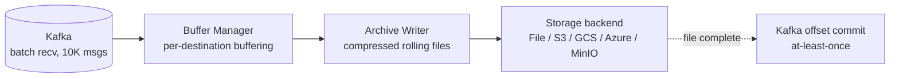
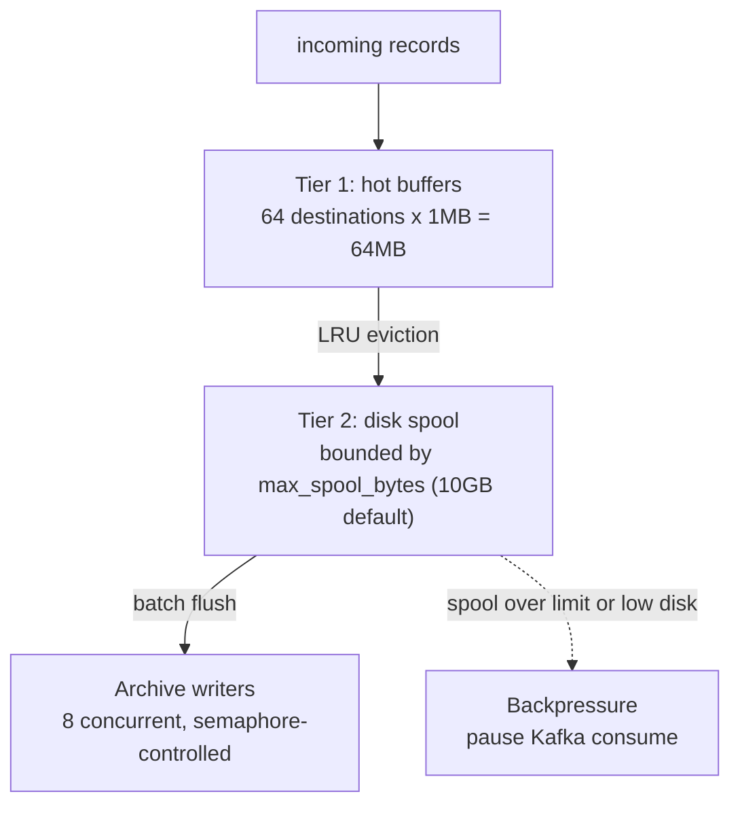

<!--
  Project:      dfe-archiver
  File:         README.md
  Purpose:      Project overview and usage documentation
  Language:     Markdown

  License:      BUSL-1.1
  Copyright:    (c) 2026 HyperI Pty Ltd
-->

# DFE Archiver

High-volume Kafka-to-storage archiver designed for PB/s scale data pipelines.
Built on the [scalo](https://github.com/hyperi-io/scalo-rs) data-plane runtime
(config cascade, logging, metrics, Kafka transport, tiered sink, deployment
contract).

## Features

- **Multiple destinations**: File, MinIO, S3, GCS, Azure Blob
- **Compression**: Zstd (default), LZ4, Snappy, Gzip, or none, each in its standard framed format (LZ4 frames `.lz4`, the snappy framing format `.sz`, gzip members `.gz`, zstd frames `.zst`), so the codec's own tools read an archive file whole
- **Smart routing**: By JSON field expressions (e.g., `org_id`) or topic
- **Rolling archives**: By final compressed file size (1GB default) or time (1 hour default)
- **At-least-once delivery** on Kafka: an offset is committed once the archive file holding its record is complete
- **Memory-capped**: Tiered buffering with configurable limits
- **Disk protection**: Backpressure when spool exceeds limits or disk space is low

## Architecture



The workspace is three crates -- `core`, `io` and `archiver` -- described under
[Where things live](#where-things-live).
[docs/architecture.md](docs/architecture.md) carries the codemap, the one-way
rules between them, and the build graph.

### Tiered Buffer Design

Handles high destination cardinality (e.g., 10,000+ orgs) without exhausting memory:



## Quick Start

```bash
# Build
cargo build --release

# Run with environment variables
KAFKA_BROKERS=localhost:9092 \
KAFKA_TOPICS=events \
ARCHIVER_DESTINATION=file://./data/archive \
./target/release/dfe-archiver

# Or with config file
./target/release/dfe-archiver --config config.yaml
```

## Configuration

Configuration follows a cascade (highest to lowest priority):

1. CLI arguments
2. Environment variables
3. `.env` file
4. Config file (`config.yaml`)
5. Built-in defaults

### Environment Variables

| Variable | Description | Default |
|----------|-------------|---------|
| `ARCHIVER_TRANSPORT` | `kafka` (a broker) or `grpc` (the Push listener) | `kafka` |
| `ARCHIVER_GRPC_LISTEN` | Push listener bind address, on `grpc` | (none) |
| `KAFKA_BROKERS` | Kafka broker addresses | `localhost:9092` |
| `KAFKA_GROUP_ID` | Consumer group ID | `dfe-archiver` |
| `KAFKA_TOPICS` | Topics to consume (comma-separated); empty discovers | (discover) |
| `KAFKA_TOPIC_INCLUDE` | Regex patterns a discovered topic must match | (none) |
| `KAFKA_TOPIC_EXCLUDE` | Regex patterns that drop a discovered topic | DLQ + internal |
| `KAFKA_TOPIC_REFRESH_SECS` | How often discovery re-reads the broker | `60` |
| `KAFKA_SASL_MECHANISM` | SASL mechanism | (none) |
| `KAFKA_SASL_USER` | SASL username | (none) |
| `KAFKA_SASL_PASSWORD` | SASL password | (none) |
| `ARCHIVER_DESTINATION` | Output URL | (none -- idles) |
| `ARCHIVER_COMPRESSION_CODEC` | Compression codec | `zstd` |
| `ARCHIVER_MEMORY_LIMIT_BYTES` | Memory guard cap; `0` auto-detects from the cgroup | `0` |
| `ARCHIVER_MEMORY_PRESSURE_THRESHOLD` | Backpressure trigger, 0.0-1.0 | `0.8` |
| `ARCHIVER_VERSION_CHECK__ENABLED` | `false` disables the startup version check | `true` |
| `METRICS_ADDR` | Metrics server address | `0.0.0.0:9090` |
| `LOG_LEVEL` | Log level | `info` |

The memory guard, the metrics listener and the scaling-pressure engine belong to
the scalo runtime and are built before the config file is read, so they are set
by the variables above (or `--metrics-addr`), never by a `memory:`, `metrics:`
or `scaling:` block in the config file. The archiver's own sections take a
single underscore; the double-underscore names belong to those scalo sections
and reach them through the cascade.

### Which transport, and idling until configured

`transport` picks how records arrive. On `kafka` the archiver joins a consumer
group and reads the landing topics; on `grpc` it binds the scalo Push listener
and the previous stage sends to it point to point, which is how a deployment
with no broker still archives. A deployment sets it from the same dial that
decides the rest of the stack's transport, so it is not normally hand-authored.

The archiver starts, passes readiness and serves health and metrics with no
work to do -- no destination, or no topics and no discovery pattern. It opens
no broker connection and binds no listener while idle, reports the
`work_config` health component Degraded with the reason, holds the
`pipeline_idle` gauge at 1, and starts the moment a config change gives it
work. `Config::idle_reason` is the whole predicate.

### Config File Example

```yaml
transport: kafka               # or "grpc" for the Push listener

kafka:
  brokers:
    - kafka:9092
  group_id: dfe-archiver
  topics:                      # omit to discover, filtered by topic_include
    - events
    - logs
  sasl_mechanism: SCRAM-SHA-256
  sasl_username: archiver
  sasl_password: ${KAFKA_PASSWORD}  # env var substitution
  acknowledgements:
    enabled: true              # false commits at receipt

archive:
  destination: s3://my-bucket/archives
  # Under the routed destination; {year} {month} {day} {hour} {minute}
  # {timestamp} {seq} are the only placeholders, anything else is refused.
  # Each file name ends -<seq>-<writer id>.
  path_template: "{year}/{month}/{day}/{hour}"
  roll_size_bytes: 1073741824  # 1GB (final compressed size)
  roll_interval_secs: 300      # unset: 300 while offsets are held, else 3600

buffer:
  flush_bytes: 1048576         # 1 MiB: a destination's buffer flushes into its file at this size
  flush_records: 100000        # ... or at this many records, whichever comes first
  flush_age_secs: 60
  writer_parallelism: 2        # object-store uploads at once, each holding 4 x multipart_chunk_size

compression:
  codec: zstd
  level: 3

routing:
  mode: expression             # or "topic"
  expression_fields:
    - org_id
    - event_type
```

### Hot-Reload Configuration

The archiver supports hot-reloading configuration without restart via SIGHUP
or file polling (5-second interval).

**Hot-reloaded (takes effect on next batch):**
- `kafka.batch_size` - re-read once per receive
- `buffer.backpressure_pause_secs` - re-read on each backpressure pause

**Requires pod restart** - everything else. The pipeline snapshots the config at
startup, so `transport`, `kafka.*`, `grpc.*`, `archive.*`, `routing.*`,
`compression.*`, `dlq.*` and the rest of `buffer.*` (the flush thresholds
included) keep their startup values until the process restarts. A reload of one
of those logs a warning naming the sections that changed, and the security event
says a restart is needed rather than reporting a reload that reached nothing.

## Storage Backends

### Local File

```yaml
archive:
  destination: file:///var/data/archive
```

### MinIO / S3

```yaml
archive:
  destination: s3://bucket-name/prefix
  s3:
    endpoint: http://minio:9000
    region: us-east-1
    access_key_id: ${AWS_ACCESS_KEY_ID}
    secret_access_key: ${AWS_SECRET_ACCESS_KEY}
```

### Google Cloud Storage

```yaml
archive:
  destination: gs://bucket-name/prefix
  gcs:
    project_id: my-project
    service_account_key: /path/to/key.json
```

### Azure Blob Storage

```yaml
archive:
  destination: az://container-name/prefix
  azure:
    account_name: myaccount
    account_key: ${AZURE_STORAGE_KEY}
```

## At-Least-Once Delivery

On `kafka`, a record's offset is committed only once the archive file holding it is durable: the store confirmed the upload, or the local file and its directories synced to disk. An object-store file is written to `<buffer.spool_dir>/uploads` and uploaded whole when it rolls -- `roll_size_bytes` or `roll_interval_secs`, whichever comes first -- so the store is never on the write path. scalo's Kafka transport tracks every offset it hands out and commits each partition only up to its lowest offset not yet released, so one destination's roll never commits past a record another destination still holds.

A failed upload keeps the staged file and its held offsets, and retries in the background with exponential backoff and jitter, from 0.5 s up to 60 s between attempts, until the store takes it. Each attempt is a fresh upload, so an outage of any length costs disk and consumer lag, never records. Intake pauses (the Kafka partitions, through the self-regulation gate) as held records near a quarter of the memory limit at 32 bytes each, or staged files near 8 GiB. A store outage becomes consumer lag, not memory or disk growth. A refusal the store gives for the object itself -- a key past the 1024-byte limit, an entity too large -- is permanent. The file's records then go to the DLQ, each as its own entry, and only with the DLQ off, or for a record too large for any DLQ backend, are they dropped, counted in `messages_dropped_total` with the reason logged. `messages_archived_total` counts records when the store confirms their file, `messages_written_total` when they go into an open file.

Each held record costs about 32 bytes of memory until its file is durable. So while offsets are held an unset `roll_interval_secs` is 300 rather than 3600: at 10k records/s that is 96 MB instead of 1.15 GB. A configured value always wins, and one above 900 logs a startup warning.

If the archiver is killed, every record not yet in a durable file is read again after the restart: up to one roll interval of intake plus whatever was still uploading, as duplicates, never as loss. The restart clears the staged files the killed process left, since their records are read again.

A batch no file takes goes to the DLQ one record per entry, and only a write the DLQ confirms releases a record's offset. When the store refused the batch for good, a record is dropped with its reason, counted in `messages_dropped_total`, if the DLQ is off or the record alone is too large for any DLQ backend once base64 grows it by a third. Every other batch -- a local disk failure, or a DLQ write that fails -- holds the commit below it, and nothing reads it again while the process runs, so the archiver drains and exits non-zero and the restart reads it again. A disk that stays broken therefore restarts the pod repeatedly rather than losing records.

Expression routing never parses a record nested past 64 levels, because sonic-rs recurses once per level with no limit and about 20,000 levels overflow a 2 MiB worker stack. The record goes to the DLQ as it arrived, under its topic, with the reason `payload nesting exceeds the maximum parse depth of 64`, and with the DLQ off it is dropped and counted in `messages_dropped_total`.

`kafka.acknowledgements.enabled: false` commits at receipt instead, so a kill loses what the open files and buffers held.

On `grpc` the listener answers each push once its records are queued: a record is released only when its file is durable, long after any sender's deadline. So the archive copy on the direct path is at-most-once -- a kill loses what the queue, the open files and the pending uploads held. A graceful stop still writes every record it answered: the listener closes first, its queue is drained into the files, then the files complete and upload. The drain gives uploads 20 s. A file still uploading then is lost on `grpc`, and read again after the restart on `kafka`.

Every file name carries a component unique to the writer, so two replicas writing one destination in one window never complete an upload onto the same key.

`pipeline_delivery_guarantee{guarantee, reason}` reads 1 for the guarantee in force: `at_least_once`/`confirmed` on `kafka` into an object store, `at_least_once_local`/`sink_confirms_locally` on `kafka` into a local path, and `best_effort` with `acks_disabled` or, on `grpc`, `sink_cannot_confirm`.

## Disk Protection

The archiver protects against disk exhaustion:

- `max_spool_bytes`: Hard limit on spool size (default 10GB)
- `min_free_disk_bytes`: Minimum free space to maintain (default 1GB)

When limits are exceeded, `push()` returns an error (backpressure), causing Kafka consumption to pause until space is freed.

## Metrics

Prometheus metrics at `http://0.0.0.0:9090/metrics` (configurable). Three layers:

**Platform** (`dfe_*`): `records_received_total`, `records_delivered_total`, `transport_sent_total`, `scaling_pressure` - auto-emitted by scalo.

**Metric groups** (`dfe_archiver_*`): `AppMetrics` (received/processed/error counts, memory, config reloads), `BufferMetrics` (bytes, records, flush duration), `ConsumerMetrics` (lag, partitions, rebalances, poll duration), `SinkMetrics` (write duration/errors by backend), `BackpressureMetrics`.

**Archiver-specific** (`dfe_archiver_*`): `files_created_total`, `files_closed_total`, `archive_roll_total{trigger}`, `compression_ratio`, `compression_duration_seconds`, `events_per_second`, `hot_buffers_active`, `unique_destinations`.

**rdkafka stats** (`rdkafka_*`): `broker_rtt_avg_seconds{broker}`, `topic_partition_consumer_lag{topic,partition}`, `consumer_rebalance_count` - collected via sidecar `StatsContext` consumer.

**Health endpoints:** `/healthz` (liveness), `/readyz` (readiness via `HealthRegistry`)

## Development

### Prerequisites

- Rust 1.94+ (edition 2024)
- Docker (for local Kafka via `dfe-docker`)
- `hyperi-ci` for CI validation

### Testing

The object-store e2e tests are deliberately not `#[ignore]`d, so the default
run starts Azurite, fake-gcs-server and LocalStack through testcontainers and
needs a Docker daemon.

```bash
# Unit, integration and object-store e2e tests
cargo nextest run

# Adds the Kafka, MinIO and GCS-credential tests, which need a live stack
TEST_MODE=docker cargo nextest run -- --ignored

# The same ignored tests against the remote dev stack
TEST_MODE=remote cargo nextest run -- --ignored

# Pre-push validation
hyperi-ci check
```

### Building

```bash
cargo build --release

# Features: jemalloc (in `full`), transport-memory, pgo-driver
cargo build --release --features jemalloc
```

### CLI Commands

```bash
dfe-archiver                      # Run the archiver service
dfe-archiver --config config.yaml # With explicit config
dfe-archiver emit-contract        # Print deployment contract JSON
dfe-archiver emit-dockerfile      # Generate Dockerfile
dfe-archiver emit-helm chart/     # Generate Helm chart
dfe-archiver version              # Version info
```

## License

This software is licensed under the Business Source License 1.1 (BUSL-1.1). See [LICENSE](LICENSE) for details.

Copyright (c) 2026 HyperI Pty Ltd

## Context

### What this is

dfe-archiver is the sink at the end of the DFE pipeline. Records arrive from Kafka or the scalo Push gRPC listener, are buffered per destination, compressed, and written as rolling files to `file`, `s3`, `gs`, `az` or MinIO. It parses nothing, enriches nothing, routes between no topics and answers no queries. Not a library either -- all three crates set `publish = false` and the artefact is a container image on ghcr. With nothing configured it starts and idles rather than crash-looping -- see [idling until configured](#which-transport-and-idling-until-configured).

### Where things live

| Path | What it holds |
|------|---------------|
| `crates/core/` | Config types, the rolling writer, the tiered buffer, routing, codecs, the storage trait. No I/O, no metrics. |
| `crates/io/` | Kafka and gRPC transports, and the object-store backends behind `create_backend`. The cold-build bottleneck, none of it ours. |
| `crates/archiver/` | The binary. `archiver.rs` the pipeline loop, `main.rs` the scalo `ServiceApp` wiring, `metrics.rs` the Prometheus surface, `contract.rs` the deployment contract. |
| `crates/archiver/src/config/loader.rs` | `init_cascade` -- the call that makes `ARCHIVER_*__*` reach anything. |
| `crates/archiver/src/bin/pgo_driver.rs` | The second `[[bin]]`, gated on `required-features = ["pgo-driver"]`. The gate keeps it out of the release payload: hyperi-ci skips feature-gated binaries when packaging, and verifies BOLT on the first packaged binary only. |
| `Dockerfile` | Generated from `contract.rs`. Its header names the generator and schema version. |
| `docs/architecture.md` | Crate map and the one-way rules. `docs/DESIGN.md` is the pipeline design. |
| `.hyperi-ci.yaml` | PGO and BOLT settings, and which gates block versus warn. `.config/nextest.toml` and `scripts/pgo-workload.sh` are what it drives. |

### Commands that prove a change

| Command | What it covers |
|---------|----------------|
| `hyperi-ci check` | The pre-push gate. `make check` is the same. |
| `cargo nextest run` | Unit, integration and object-store e2e. Those are not `#[ignore]`d, so it starts Azurite, fake-gcs-server and LocalStack via testcontainers and needs a Docker daemon. |
| `TEST_MODE=docker cargo nextest run -- --ignored` | Adds the Kafka, MinIO and GCS-credential tests, which need a live stack. `TEST_MODE=remote` runs them against the remote dev stack. |
| `cargo deny check advisories` | Advisories and yanked crates. Run it by hand and read it. |

Green says less than it looks, three ways:

- `quality.rust.audit` and `quality.rust.deny` are `warn`, so red advisories leave the run green (#85).
- the `default` nextest profile sets `retries = 0` deliberately, because hyperi-ci never selects `--profile ci`. A retry there hides a real intermittent. A test pins it.
- the `push` trigger ignores `docs/**` and `**.md`, so a docs-only push runs nothing. `pull_request` has no such filter.

### What tends to bite

| Don't | Do | Why |
|-------|----|-----|
| Commit the Kafka offsets of a batch once it is written into a file. | Hold them on the file and release them when it completes. The armed consumer commits each partition up to its lowest offset not yet released. | A file is an upload in progress until it rolls, and a kill abandons it. Default routing is expression on `org_id`, so one partition fans out to several files that complete at different times (#82). |
| Build a second `MetricsManager` in a test and assert on `render()`. | Share one manager, assert on the delta. | `set_global_recorder` succeeds once per process. Later managers keep the existing recorder and render an empty string. nextest forks per test and hides it, `cargo-llvm-cov` runs one process and does not (#84). |
| Trust `cargo update -p rustls` to clear the advisory. | `cargo update -p rustls --precise 0.23.45`, then build both arches. | Plain `-p` stops at 0.23.43, still vulnerable, because 0.23.45 needs aws-lc-rs to move too. `--precise` drags `aws-lc-sys` 0.41 to 0.45, which compiles C (#85). |
| Put `memory:`, `metrics:` or `scaling:` in the config file. | Set them as `ARCHIVER_<SECTION>__<KEY>` env vars. | scalo builds the memory guard, metrics listener and scaling engine before the config file is read. Those blocks once parsed and validated while reaching nothing. |
| Point `scalo` at a local path to try an unreleased change. | Keep the crates.io range. Read the local clone instead. | A path override builds against uncommitted work, so the release does not reproduce. |
| Hand-edit `Dockerfile`. | `dfe-archiver emit-dockerfile > Dockerfile`. | It is generated from the deployment contract, and a scalo release can move the generator or its schema version. |
| Give PGO a port check or a startup probe as its workload. | Drive consume, route, compress and write for 60s or more. | Shallow workloads bias the profile toward startup paths and give NEGATIVE gains. Measured on dfe-loader and dfe-receiver. |

### Where this sits

Inbound:

- **hyperi-io/scalo-rs**, cargo dependency. The workspace declares one `scalo` range in `[workspace.dependencies]` and all three crates inherit it, so a scalo release is a range check, a bump and a rebuild.
- **hyperi-io/scalo-rs** again, generator, lockstep. `Dockerfile` comes from `scalo::deployment::generate_dockerfile()` over this repo's contract, so a generator or schema-version change means regenerate and commit the diff.

Outbound -- the repo a change here breaks:

- **hyperi-io/dfe-infra**, image pin, lockstep. `helm/charts/dfe-archiver/Chart.yaml` carries the `appVersion`, drift-checked against dfe-infra's `versions.yaml`. A release here is not deployed until that pin moves. The chart lives there -- `dfe-archiver emit-helm` can write one, this repo commits none.

Regenerate both from dfe-infra: `python3 scripts/dfe-stack suite --consumer dfe-archiver`, and again with `--producer`.
