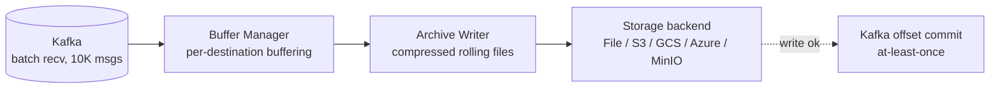
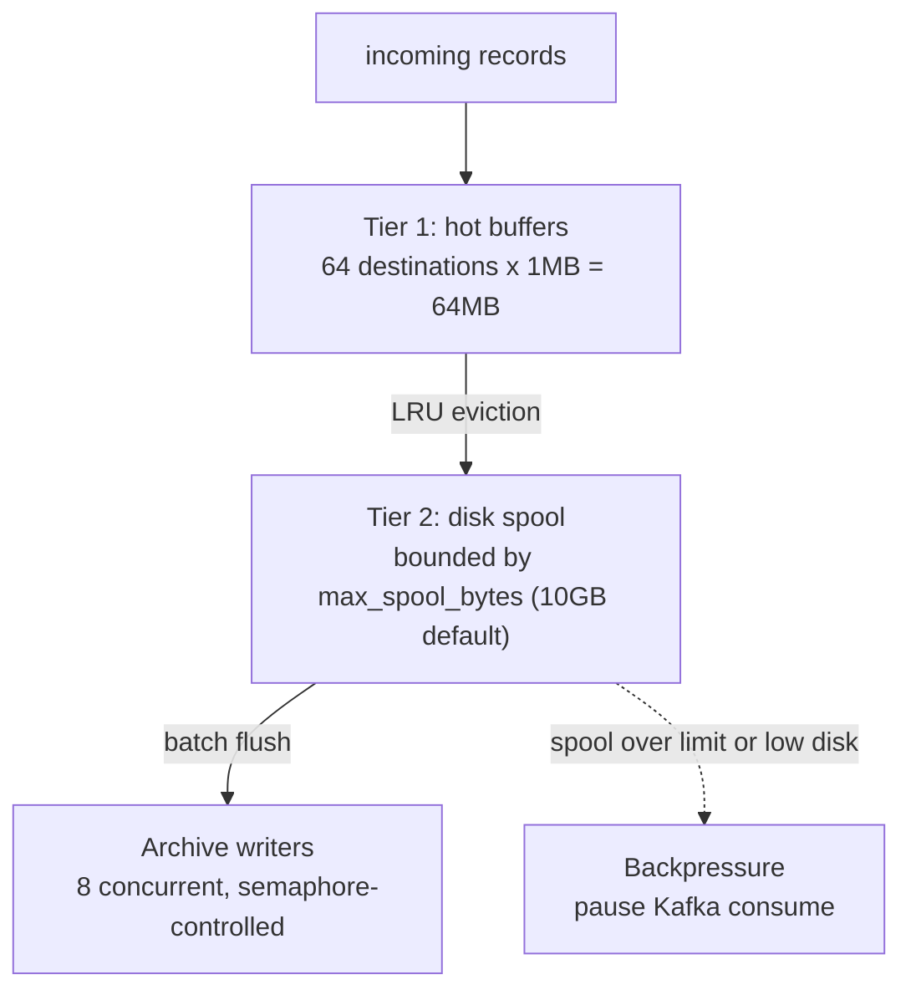

<!--
  Project:      dfe-archiver
  File:         README.md
  Purpose:      Project overview and usage documentation
  Language:     Markdown

  License:      BUSL-1.1
  Copyright:    (c) 2026 HyperI Pty Ltd
-->

# DFE Archiver

High-volume Kafka-to-storage archiver designed for PB/s scale data pipelines.
Built on the [scalo](https://github.com/hyperi-io/scalo-rs) data-plane runtime
(config cascade, logging, metrics, Kafka transport, tiered sink, deployment
contract).

## Features

- **Multiple destinations**: File, MinIO, S3, GCS, Azure Blob
- **Compression**: Zstd (default), LZ4, Snappy, Gzip, or none
- **Smart routing**: By JSON field expressions (e.g., `org_id`) or topic
- **Rolling archives**: By final compressed file size (1GB default) or time (1 hour default)
- **At-least-once delivery**: Kafka offset commit only after successful archive write
- **Memory-capped**: Tiered buffering with configurable limits
- **Disk protection**: Backpressure when spool exceeds limits or disk space is low

## Architecture



### Workspace Structure

The project is a Rust workspace with three crates:

- **`crates/core`** - Types, configuration, compression codecs, buffer manager, routing, archive writer
- **`crates/io`** - Kafka transport adapter, storage backends (File, S3, GCS, Azure, MinIO)
- **`crates/archiver`** - Binary entry point, pipeline orchestrator, metrics, CLI, deployment contract

[ARCHITECTURE.md](ARCHITECTURE.md) carries the codemap, the one-way rules
between those crates, and the build graph.

### Tiered Buffer Design

Handles high destination cardinality (e.g., 10,000+ orgs) without exhausting memory:



## Quick Start

```bash
# Build
cargo build --release

# Run with environment variables
KAFKA_BROKERS=localhost:9092 \
KAFKA_TOPICS=events \
ARCHIVER_DESTINATION=file://./data/archive \
./target/release/dfe-archiver

# Or with config file
./target/release/dfe-archiver --config config.yaml
```

## Configuration

Configuration follows a cascade (highest to lowest priority):

1. CLI arguments
2. Environment variables
3. `.env` file
4. Config file (`config.yaml`)
5. Built-in defaults

### Environment Variables

| Variable | Description | Default |
|----------|-------------|---------|
| `ARCHIVER_TRANSPORT` | `kafka` (a broker) or `grpc` (the Push listener) | `kafka` |
| `ARCHIVER_GRPC_LISTEN` | Push listener bind address, on `grpc` | (none) |
| `KAFKA_BROKERS` | Kafka broker addresses | `localhost:9092` |
| `KAFKA_GROUP_ID` | Consumer group ID | `dfe-archiver` |
| `KAFKA_TOPICS` | Topics to consume (comma-separated); empty discovers | (discover) |
| `KAFKA_TOPIC_INCLUDE` | Regex patterns a discovered topic must match | (none) |
| `KAFKA_TOPIC_EXCLUDE` | Regex patterns that drop a discovered topic | DLQ + internal |
| `KAFKA_TOPIC_REFRESH_SECS` | How often discovery re-reads the broker | `60` |
| `KAFKA_SASL_MECHANISM` | SASL mechanism | (none) |
| `KAFKA_SASL_USER` | SASL username | (none) |
| `KAFKA_SASL_PASSWORD` | SASL password | (none) |
| `ARCHIVER_DESTINATION` | Output URL | (none -- idles) |
| `ARCHIVER_COMPRESSION_CODEC` | Compression codec | `zstd` |
| `ARCHIVER_MEMORY_LIMIT_BYTES` | Memory guard cap; `0` auto-detects from the cgroup | `0` |
| `ARCHIVER_MEMORY_PRESSURE_THRESHOLD` | Backpressure trigger, 0.0-1.0 | `0.8` |
| `ARCHIVER_VERSION_CHECK__ENABLED` | `false` disables the startup version check | `true` |
| `METRICS_ADDR` | Metrics server address | `0.0.0.0:9090` |
| `LOG_LEVEL` | Log level | `info` |

The memory guard, the metrics listener and the scaling-pressure engine belong to
the scalo runtime and are built before the config file is read, so they are set
by the variables above (or `--metrics-addr`), never by a `memory:`, `metrics:`
or `scaling:` block in the config file. The archiver's own sections take a
single underscore; the double-underscore names belong to those scalo sections
and reach them through the cascade.

### Which transport, and idling until configured

`transport` picks how records arrive. On `kafka` the archiver joins a consumer
group and reads the landing topics; on `grpc` it binds the scalo Push listener
and the previous stage sends to it point to point, which is how a deployment
with no broker still archives. A deployment sets it from the same dial that
decides the rest of the stack's transport, so it is not normally hand-authored.

The archiver starts, passes readiness and serves health and metrics with no
work to do -- no destination, or no topics and no discovery pattern. It opens
no broker connection and binds no listener while idle, reports the
`work_config` health component Degraded with the reason, holds the
`pipeline_idle` gauge at 1, and starts the moment a config change gives it
work. `Config::idle_reason` is the whole predicate.

### Config File Example

```yaml
transport: kafka               # or "grpc" for the Push listener

kafka:
  brokers:
    - kafka:9092
  group_id: dfe-archiver
  topics:                      # omit to discover, filtered by topic_include
    - events
    - logs
  sasl_mechanism: SCRAM-SHA-256
  sasl_username: archiver
  sasl_password: ${KAFKA_PASSWORD}  # env var substitution

archive:
  destination: s3://my-bucket/archives
  # Under the routed destination; {year} {month} {day} {hour} {minute}
  # {timestamp} {seq} are the only placeholders, anything else is refused
  path_template: "{year}/{month}/{day}/{hour}"
  roll_size_bytes: 1073741824  # 1GB (final compressed size)
  roll_interval_secs: 3600     # 1 hour

buffer:
  flush_bytes: 67108864        # 64MB
  flush_age_secs: 60
  writer_parallelism: 4

compression:
  codec: zstd
  level: 3

routing:
  mode: expression             # or "topic"
  expression_fields:
    - org_id
    - event_type
```

### Hot-Reload Configuration

The archiver supports hot-reloading configuration without restart via SIGHUP
or file polling (5-second interval).

**Hot-reloaded (takes effect on next batch):**
- `kafka.batch_size` - re-read once per receive
- `buffer.backpressure_pause_secs` - re-read on each backpressure pause

**Requires pod restart** - everything else. The pipeline snapshots the config at
startup, so `transport`, `kafka.*`, `grpc.*`, `archive.*`, `routing.*`,
`compression.*`, `dlq.*` and the rest of `buffer.*` (the flush thresholds
included) keep their startup values until the process restarts. A reload of one
of those logs a warning naming the sections that changed, and the security event
says a restart is needed rather than reporting a reload that reached nothing.

## Storage Backends

### Local File

```yaml
archive:
  destination: file:///var/data/archive
```

### MinIO / S3

```yaml
archive:
  destination: s3://bucket-name/prefix
  s3:
    endpoint: http://minio:9000
    region: us-east-1
    access_key_id: ${AWS_ACCESS_KEY_ID}
    secret_access_key: ${AWS_SECRET_ACCESS_KEY}
```

### Google Cloud Storage

```yaml
archive:
  destination: gs://bucket-name/prefix
  gcs:
    project_id: my-project
    service_account_key: /path/to/key.json
```

### Azure Blob Storage

```yaml
archive:
  destination: az://container-name/prefix
  azure:
    account_name: myaccount
    account_key: ${AZURE_STORAGE_KEY}
```

## At-Least-Once Delivery

The archiver guarantees at-least-once delivery:

1. Messages are consumed from Kafka in batches
2. Messages are buffered per-destination
3. Buffers are compressed and written to storage
4. **Only after successful storage write**, Kafka offsets are committed

If the archiver crashes:
- Before write: Messages are re-consumed from Kafka (no data loss)
- After write, before commit: Duplicates on restart (at-least-once semantics)

## Disk Protection

The archiver protects against disk exhaustion:

- `max_spool_bytes`: Hard limit on spool size (default 10GB)
- `min_free_disk_bytes`: Minimum free space to maintain (default 1GB)

When limits are exceeded, `push()` returns an error (backpressure), causing Kafka consumption to pause until space is freed.

## Metrics

Prometheus metrics at `http://0.0.0.0:9090/metrics` (configurable). Three layers:

**Platform** (`dfe_*`): `records_received_total`, `records_delivered_total`, `transport_sent_total`, `scaling_pressure` - auto-emitted by scalo.

**Metric groups** (`dfe_archiver_*`): `AppMetrics` (received/processed/error counts, memory, config reloads), `BufferMetrics` (bytes, records, flush duration), `ConsumerMetrics` (lag, partitions, rebalances, poll duration), `SinkMetrics` (write duration/errors by backend), `BackpressureMetrics`.

**Archiver-specific** (`dfe_archiver_*`): `files_created_total`, `files_closed_total`, `archive_roll_total{trigger}`, `compression_ratio`, `compression_duration_seconds`, `events_per_second`, `hot_buffers_active`, `unique_destinations`.

**rdkafka stats** (`rdkafka_*`): `broker_rtt_avg_seconds{broker}`, `topic_partition_consumer_lag{topic,partition}`, `consumer_rebalance_count` - collected via sidecar `StatsContext` consumer.

**Health endpoints:** `/healthz` (liveness), `/readyz` (readiness via `HealthRegistry`)

## Development

### Prerequisites

- Rust 1.94+ (edition 2024)
- Docker (for local Kafka via `dfe-docker`)
- `hyperi-ci` for CI validation

### Testing

The object-store e2e tests are deliberately not `#[ignore]`d, so the default
run starts Azurite, fake-gcs-server and LocalStack through testcontainers and
needs a Docker daemon.

```bash
# Unit, integration and object-store e2e tests
cargo nextest run

# Adds the Kafka, MinIO and GCS-credential tests, which need a live stack
TEST_MODE=docker cargo nextest run -- --ignored

# The same ignored tests against the remote dev stack
TEST_MODE=remote cargo nextest run -- --ignored

# Pre-push validation
hyperi-ci check
```

### Building

```bash
cargo build --release

# Features: jemalloc (in `full`), transport-memory, pgo-driver
cargo build --release --features jemalloc
```

### CLI Commands

```bash
dfe-archiver                      # Run the archiver service
dfe-archiver --config config.yaml # With explicit config
dfe-archiver emit-contract        # Print deployment contract JSON
dfe-archiver emit-dockerfile      # Generate Dockerfile
dfe-archiver emit-helm chart/     # Generate Helm chart
dfe-archiver version              # Version info
```

## License

This software is licensed under the Business Source License 1.1 (BUSL-1.1). See [LICENSE](LICENSE) for details.

Copyright (c) 2026 HyperI Pty Ltd
