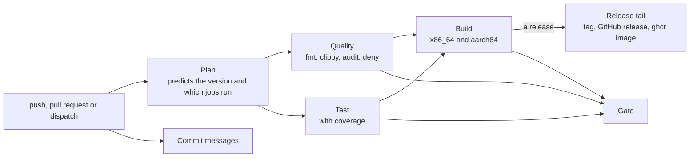
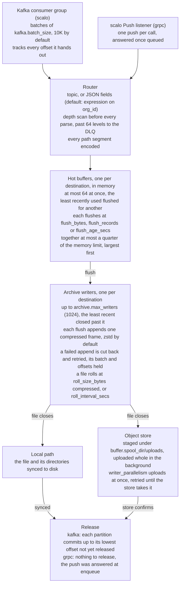
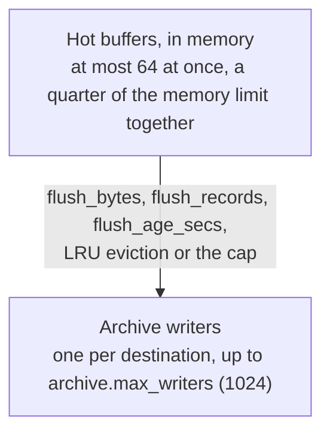
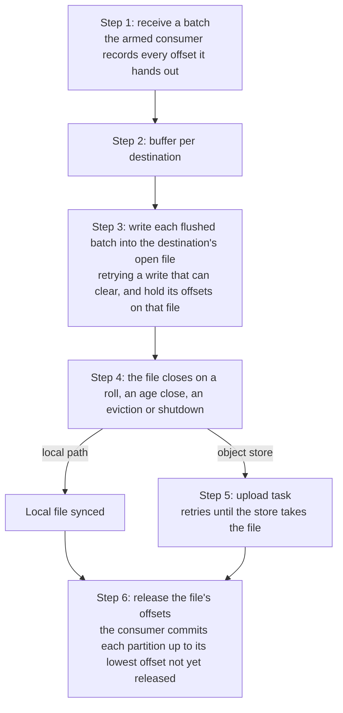

<!--
  Project:      dfe-archiver
  File:         docs/DESIGN.md
  Purpose:      Architecture and design documentation
  Language:     Markdown

  License:      BUSL-1.1
  Copyright:    (c) 2026 HyperI Pty Ltd
-->

# DFE Archiver Design Document

High-volume Kafka-to-storage archiver designed for PB/s scale data pipelines.

## Table of Contents

1. [Building & Artifacts](#building--artifacts)
2. [Overview](#overview)
3. [Architecture](#architecture)
4. [Inbound transport](#inbound-transport)
5. [Data Flow](#data-flow)
6. [Tiered Buffer Design](#tiered-buffer-design)
7. [At-Least-Once Delivery](#at-least-once-delivery)
8. [Rolling Policy](#rolling-policy)
9. [Disk Protection](#disk-protection)
10. [Routing](#routing)
11. [Compression](#compression)
12. [Storage Backends](#storage-backends)
13. [Configuration](#configuration)
14. [Metrics](#metrics)
15. [Deployment](#deployment)

---

## Building & Artifacts

### Local Build

```bash
# Debug build
cargo build

# Release build (production, with jemalloc)
cargo build --features default,jemalloc --release
```

**Output location:**

| Build Type | Path |
|---|---|
| Debug (native) | `target/debug/dfe-archiver` |
| Release (native) | `target/release/dfe-archiver` |
| Cross-compile (x86_64) | `target/x86_64-unknown-linux-gnu/release/dfe-archiver` |
| Cross-compile (aarch64) | `target/aarch64-unknown-linux-gnu/release/dfe-archiver` |

### CI/CD Pipeline

`.github/workflows/ci.yml` calls hyperi-ci's reusable `rust-ci.yml` workflow. Configuration is in `.hyperi-ci.yaml`.

**Pipeline stages:**



### Build Targets

| Target | Architecture | Notes |
|---|---|---|
| `x86_64-unknown-linux-gnu` | AMD64 | Primary production target |
| `aarch64-unknown-linux-gnu` | ARM64 | AWS Graviton, Apple Silicon Linux |

Cross-compilation uses the CI cross-compilation toolchain (not vendored system
libraries). `openssl` is vendored for portability; `rdkafka` uses `cmake-build`
to compile `librdkafka` from source.

### Artifact Destinations

No crate is published: all three set `publish = false`.

| Artefact | Destination |
|---|---|
| Container image | `ghcr.io/hyperi-io/dfe-archiver` |
| Binaries | hyperi-ci's `release.destinations.binaries`, Cloudflare R2 (`downloads.hyperi.io`) by default |
| Release notes | `https://github.com/hyperi-io/dfe-archiver/releases/`, with no binaries attached |

**Binary naming convention:**

```text
dfe-archiver-{version}-linux-amd64     # x86_64
dfe-archiver-{version}-linux-arm64     # aarch64
```

**Checksums:** `SHA256SUMS` file published alongside binaries.

### Release Profile

```toml
[profile.release]
lto = "thin"          # Link-time optimization
codegen-units = 1     # Single codegen unit for better optimization
strip = true          # Remove debug symbols
panic = "abort"       # Smaller binary, no unwinding overhead
opt-level = 3         # Maximum optimization
```

---

## Overview

DFE Archiver consumes messages from Kafka topics and archives them to various storage backends (File, MinIO, S3, GCS, Azure Blob) with compression and smart routing. It is designed for:

- **PB/s scale throughput** - optimized hot path, SIMD JSON parsing
- **High destination cardinality** - supports 10,000+ concurrent destinations via tiered buffering
- **At-least-once delivery** - Kafka offsets committed only after successful archive write
- **Bounded memory** - every destination's buffer together takes at most a quarter of the memory limit
- **Pluggable compression** - zstd (default), lz4, snappy, gzip

### Tech Stack

| Component | Technology |
|-----------|------------|
| Language | Rust 2024 (MSRV 1.94) |
| Async Runtime | Tokio |
| Shared Library | scalo (config, logging, metrics, transport) |
| JSON Parsing | sonic-rs (SIMD-accelerated) |
| Compression | zstd, lz4_flex, snap, flate2 |
| Cloud Storage | object_store (AWS, GCP, Azure) |
| Deployment | Kubernetes with KEDA autoscaling |

---

## Architecture



---

## Inbound transport

`transport` selects how records reach the archiver, and it is the only thing
about the pipeline that differs between the two forms.

| `transport` | How records arrive | Release point |
|---|---|---|
| `kafka` | a consumer group over the landing topics | broker offset commit once the archive file holding the record is complete |
| `grpc` | the scalo Push listener, from the previous stage | the Push RPC response, at enqueue |

On `kafka` an empty `topics` list turns on broker-side discovery: the topic set
is re-read every `topic_refresh_secs` and filtered by `topic_include` and
`topic_exclude`, so a source added later is archived without a restart. Where a
source has both a landing and a transformed topic, discovery keeps the landing
one -- the archiver's job is the record as it arrived, which is the reverse of
the loader's preference.

`grpc` exists so a deployment with no broker can still archive: the previous
stage fans a matched record out to the loader and to the archiver over the same
Push RPC. A push stream keeps no backlog, so the KEDA composite drops its
`kafka_lag` term there rather than reading a false zero.

The listener answers each push once its records are queued. A record is released only when its archive file completes, at the roll interval, long after any sender's deadline, so holding the answer until then would expire every push and the sender would resend it. The archive copy on `grpc` is therefore at-most-once: a kill loses what the queue and the open files held, and `pipeline_delivery_guarantee` reports `best_effort` with reason `sink_cannot_confirm`. An unset `roll_interval_secs` is 300 on `grpc`, as on the bus with acknowledgements on, so an open file holds about five minutes of intake at most rather than an hour.

### Why only two

scalo offers more transports and DLQ backends than the archiver uses. It compiles in
`transport-kafka`, `transport-grpc` and `dlq-kafka`, and that bound is a
decision rather than an oversight: a DFE deployment feeds the archiver from a
broker or from the previous stage and from nothing else, the DLQ has to survive
the charts' read-only rootfs (which rules the file backend out as an EROFS
no-op), and `validate_config` refuses any other `transport` value at boot. The
feature lists in the three member crates carry the same note, so adding
`transport-all` grows the image without widening anything an operator can
select.

### Idle until configured

An archiver with no destination, or on the bus with no topics and no discovery
pattern, has nothing to do. It starts anyway: it stays Ready, serves health and
metrics, opens no broker connection and binds no listener, reports the
`work_config` health component Degraded with the reason, and holds
`pipeline_idle` at 1. The first config change that gives it work starts the
pipeline with no restart. That behaviour is scalo's (`scalo::lifecycle`); the
predicate is this app's, in `Config::idle_reason`.

Structural faults are the other half of the split and still refuse loudly: an
unknown transport, a `grpc` form with no listen address, a bus form with no
brokers, a codec or routing mode that does not exist.

## Data Flow

### Message Processing Pipeline

1. **Ingest**: Batch receive from the configured transport (10K messages default)
2. **Routing**: Determine destination based on topic or JSON expression
3. **Buffering**: Buffer per destination in memory. A buffer the LRU evicts flushes into its file
4. **Flush Triggers**: Size (`flush_bytes`, 1 MiB), records (100K), age (60s), or the shared cap on every buffer together
5. **Compression**: Compress the flushed batch with the configured codec
6. **File Write**: Append it to the destination's open file, local or staged. A staged file uploads in the background once it closes
7. **Release**: Commit offsets once the file holding their records is complete (a no-op on `grpc`)

### Critical Path Optimizations

- **SIMD JSON parsing** via sonic-rs for expression routing
- **Zero-copy message handling** where possible
- **Lock-free atomics** for counters and stats
- **DashMap** for concurrent buffer access
- **CompactString** for destination keys (24-byte inline storage)
- **One writer per destination**, capped at `archive.max_writers`, and a semaphore bounding uploads at `buffer.writer_parallelism`

---

## Tiered Buffer Design

### Problem Statement

With expression-based routing (e.g., by `org_id`), you could have 10,000+ unique destinations. A fixed buffer per destination multiplies: 10,000 destinations x 64 MB is 640 GB.

### Solution: a ceiling per destination and a cap on all of them



Nothing spills to disk ahead of the writers. The only files on local disk are the archive files themselves: the open file on a local path, or the staged copy of an object-store file.

### Hot buffers

- **Count**: at most 64 destinations buffer at once. A record for another flushes the least recently used buffer into its file first.
- **Per destination**: a buffer flushes at `flush_bytes` plus one record, at `flush_records`, or at `flush_age_secs`, whichever comes first.
- **All together**: at most a quarter of the memory guard's limit. Past it the largest buffers flush first, so `flush_bytes` is a ceiling per destination, never multiplied by the destination count.
- **Allocation**: a buffer allocates nothing until a record arrives, and hands its memory to the batch when it flushes. The cap counts bytes buffered, and a growing buffer's allocation can run to twice that.

### Archive writers

One writer per destination, up to `archive.max_writers` (1024). Past it the least recently used writer is closed in the background, and its file completes as on a roll. A writer holds no write buffer between flushes: 1024 writers that have each flushed once held 1.2 MB between them, measured with jemalloc, where a 1 MiB buffer kept per writer held 1 GiB.

### Buffer Configuration

| Key | Default | Description |
|-----|---------|-------------|
| `buffer.flush_bytes` / `ARCHIVER_FLUSH_BYTES` | 1 MiB | Size at which a destination's buffer flushes into its file. Each buffer holds up to this plus one record |
| `buffer.flush_records` | 100,000 | Record count at which a destination's buffer flushes, whatever its size |
| `buffer.flush_age_secs` / `ARCHIVER_FLUSH_INTERVAL_SECS` | 60 | Age at which a buffer flushes whatever its size |
| `buffer.writer_parallelism` | 2 | Object-store uploads at once, each holding four parts of `archive.multipart_chunk_size` |
| `buffer.spool_dir` / `ARCHIVER_SPOOL_DIR` | `/var/spool/dfe/archiver` | Parent of the staging directory, `uploads/` |
| `archive.max_writers` | 1024 | Open archive writers, one per destination |

The 64-buffer count and the quarter share are fixed, not configured.

---

## At-Least-Once Delivery

### Guarantee

On `kafka` with `acknowledgements.enabled` (the default) no record is lost: a kill, a failed upload, a failing local disk or a store outage of any length costs duplicates or consumer lag. Only a record refused for good -- by the store for its object, by the codec, or by routing for its nesting depth -- can be dropped, when no DLQ can take it, and it is counted. On `grpc` the archive copy is at-most-once (see [Inbound transport](#inbound-transport)).

### Implementation



An object-store file is written to local staging, `<buffer.spool_dir>/uploads`, and uploaded whole once it closes. The loop never waits on the store: step 5 runs in a background task, which the loop collects each cycle. A failed upload keeps the staged file and its held offsets and retries with exponential backoff and jitter, from 0.5 s up to 60 s between attempts. Every attempt is a fresh multipart upload from the staged copy, so it signs its requests afresh however long the store has been down, and a failed attempt aborts its upload so no parts are left in the store. A staged copy that cannot be read back -- missing, unreadable by permission, shorter than the bytes staged -- is moved to `<buffer.spool_dir>/uploads/quarantine` and its offsets are released `Errored`, because no retry can read it. Any other read error, EIO included, is retried. On a local path, step 4 syncs the file, and every directory above it up to the destination, to disk.

Holding costs memory for as long as a file is not durable: about 32 bytes a record, scalo's offset tracking plus the writer's own eight. At 10k records/s that is 96 MB over a 300 s roll and 1.15 GB over an hour. So while offsets are held an unset `roll_interval_secs` defaults to 300 rather than 3600. A configured value always wins, and one above 900 logs a startup warning with the cost.

While uploads fail, held records and staged files grow, so both are pressure sources on the self-regulation latch that pauses the Kafka partitions. Held records read against a quarter of the memory limit at 32 bytes each, staged bytes against 8 GiB, under the spool volume's 10 GiB `emptyDir` limit. Both pause at the latch's `pause_above` (0.8 by default), so a store outage turns into consumer lag rather than memory or disk growth. With self-regulation off nothing pauses, and the archiver logs that at startup.

Only a refusal the store gives for the object itself is permanent: an invalid path, a key past the 1024-byte limit, which is checked before any record is staged, or an `EntityTooLarge`/`KeyTooLongError` answer. A file refused at upload is read back a block at a time, each block one flush decompressed on its own, and its records go to the DLQ one entry per line, with the routed destination a batch carries. A payload is written as it arrived with a newline after it, so a payload holding a newline of its own spans lines: when a file holds more lines than records, each block goes to the DLQ whole, as one entry saying so, and no record, text or binary, is split across entries. The file's offsets are released `Rejected` once the DLQ confirms them, and a record too large for any DLQ backend is counted dropped. A file that cannot be read back, or a DLQ write that fails, is released `Errored`, so a restart writes the records again. With the DLQ off the records are released `Dropped`, counted in `messages_dropped_total`, and the reason is logged. Anything else, credentials and a missing bucket included, is retried, because retrying costs lag while dropping costs records.

A batch refused for good as it is written -- by the store, or by the codec -- goes to the DLQ through scalo's confirming write, one entry per record, and only a write the DLQ confirms releases a record's offset, `Rejected`. The buffer records where each record ends, because a payload may hold a newline of its own. First `Dlq::refusal` measures each entry against every backend's ceiling: the Kafka producer's `message.max.bytes`, scalo's 16 MiB, against an entry whose base64 payload is a third larger than the record. A record no backend can ever hold is released `Dropped` without a write, counted in `messages_dropped_total` with the reason logged, so a restart never meets the same pair of refusals, and the rest of the batch still goes to the DLQ. A broker or topic ceiling below the producer's is not seen there, and fails the write instead.

With the DLQ off, a refused batch is released `Dropped` with its reason. A failed DLQ write is released `Errored`, because it can clear.

A local write that fails in a way that can clear -- a full or failing disk, staging that cannot be created -- is never dead-lettered. The failed append is cut back to the file's last whole block, and the batch and its offsets are held while the write is retried with backoff and jitter, from 0.1 s up to 5 s between attempts. The loop receives nothing until the write lands, so nothing later is read or committed past it, and a disk that stays broken shows as consumer lag and one warning rather than lost records. Once shutdown begins, a write still failing gets 10 s more, then its batch is released `Errored`. A file that cannot be cut back, or cannot complete -- its sync or its staging failed -- is given up, and its offsets are `Errored` too.

Nothing reads an `Errored` span again short of a restart or rebalance, and scalo's consumer has no seek back to the commit floor, so the loop ends with `Error::Withheld`: the process drains, exits non-zero, and the restart reads again from the committed offset. A source that cannot deliver the records again -- `grpc`, or `kafka` with acknowledgements off -- has already let them go, so they are counted in `messages_dropped_total{reason="unreplayable"}` instead.

Inbound-filter dead letters are screened too. One no DLQ backend can hold is dropped and counted, because the filter routed it out of the archive by policy and no restart can land it. A failed DLQ write for the rest is `Errored`.

`kafka.acknowledgements.enabled: false` commits each batch at receipt instead.

Every dropped record is counted in `messages_dropped_total` under one `reason`: `refused` (the store or the codec, with the DLQ off), `dlq_too_large`, `too_deep` (with the DLQ off) or `unreplayable`.

### Failure Scenarios

| Failure Point | Outcome | Data Status |
|---------------|---------|-------------|
| Kill before the file is durable | Restart re-reads every record the file held, and removes the staged files it left | Duplicates, up to one roll interval plus pending uploads |
| Upload fails | File and offsets kept, upload aborted and retried, intake paused near the caps | Delayed, never lost |
| Staged copy cannot be read back | File quarantined, offsets released `Errored`, the process exits and restarts | Duplicates |
| Store refuses the object for good, DLQ confirms | Records read back into the DLQ, offsets released | Records are in the DLQ |
| Store refuses the object for good, DLQ off | Offsets released `Dropped`, counted, reason logged | Dropped |
| Local write fails in a way that can clear | Append cut back, batch and offsets held, write retried, intake held | Delayed, never lost |
| Local write still failing 10 s into shutdown | Offsets released `Errored`, the restart reads them again | Duplicates |
| Local file cannot complete or be cut back | Offsets released `Errored`, the process exits and restarts | Duplicates |
| Codec refuses a batch, DLQ confirms | Offsets released `Rejected` | Records are in the DLQ |
| Refused for good, no DLQ backend can hold one record | That record's offset released `Dropped`, counted, reason logged. The rest go to the DLQ | That record dropped |
| Refused for good, DLQ write fails | Offsets released `Errored`, the process exits and restarts | Duplicates |
| After the commit | Clean | Archived once |

### Shutdown

The run loop stops first. The drain then closes the source -- the Push listener stops answering, the Kafka consumer stops fetching and can still commit -- and receives until the source reports it is empty, so every push already answered is written. Buffers flush into their files, evicted writers finish closing, every open file completes, and the uploads get 20 s. A file still uploading then keeps its offsets unreleased and its staged copy on disk.

### Restart

A completed staged file carries a manifest beside it, `<name>.part.json`, with its object path and the length of each block. At startup the staging directory is settled before anything new is staged:

- **`kafka` with acknowledgements on**: every staged file is removed, because its records are read again from the committed offset.
- **`grpc`, or acknowledgements off**: nothing delivers those records again. A file whose manifest matches its size is uploaded. One never completed, or whose manifest cannot be read, is moved to `<buffer.spool_dir>/uploads/quarantine` for an operator.

Quarantine holds at most 1 GiB, which with the 8 GiB staging cap stays under the spool volume's 10 GiB limit. A file past it is removed. Each outcome is counted: `staged_files_recovered_total`, `staged_files_quarantined_total{reason}` and `staged_files_removed_total{reason}`.

### Object keys

Every file name ends `-<seq>-<writer id>`. A staged file is never checked against the store, so two writers on the same destination and window -- two replicas, or an evicted writer still closing beside its replacement -- would otherwise pick the same key, and the later upload would replace the earlier object.

---

## Rolling Policy

### File Rolling Triggers

Archives are rolled (closed and new file opened) when either condition is met:

1. **Size-based**: Final compressed file size exceeds threshold (default 1GB)
2. **Time-based**: File age exceeds threshold (default 300 s while offsets are held and on `grpc`, otherwise 1 hour)

### Important: Compressed File Size

Rolling is based on **final compressed file size**, NOT:

- Inbound data size
- Uncompressed data size
- Buffered data size

This ensures predictable archive file sizes on storage (optimal for cloud storage parallelism).

### Configuration

```yaml
archive:
  roll_size_bytes: 1073741824  # 1GB final compressed size
  roll_interval_secs: 300      # unset: 300 while offsets are held or on grpc, else 3600
```

### Path Templates

The template sits under the routed destination, which is already the topic (or
the expression-routed segments), so it carries no topic placeholder of its own:

```yaml
archive:
  path_template: "{year}/{month}/{day}/{hour}"
```

The supported variables, and the whole set -- config validation refuses any
other `{...}` token rather than letting it reach the object key as literal
braces:

- `{year}`, `{month}`, `{day}`, `{hour}`, `{minute}` - Timestamp components
- `{timestamp}` - Unix timestamp
- `{seq}` - Rolled-file sequence number

The writer appends `-<seq>-<writer id>`, the extension and the codec suffix to the expanded template, whatever the template holds. See [Object keys](#object-keys).

---

## Disk Protection

### What is on local disk

Only archive files: the open file of a local destination, and under `<buffer.spool_dir>/uploads` the staged copy of each object-store file until the store takes it, with the quarantine beside them. Nothing spools ahead of the writers.

### Protection Mechanisms

1. **Free space at startup**: the archiver refuses to start with less than 1 GiB free on the `buffer.spool_dir` volume, read through the `fs2` crate.
2. **Staged bytes**: a pressure source on the self-regulation latch, read against 8 GiB, under the spool volume's 10 GiB `emptyDir` limit past which kubelet evicts the pod. Intake pauses at the latch's `pause_above`, so a store outage turns into consumer lag rather than disk growth.
3. **Quarantine**: at most 1 GiB. A file past it is removed and counted.
4. **A full disk**: a local write that fails is held and retried, never dropped, and the loop receives nothing until it lands. See [At-Least-Once Delivery](#at-least-once-delivery).

### Metrics

- `dfe_archiver_staged_bytes` - Bytes staged and not yet uploaded
- `dfe_archiver_uploads_pending` - Staged files the store has not yet confirmed
- `dfe_archiver_staged_files_quarantined_total{reason}` and `dfe_archiver_staged_files_removed_total{reason}` - Staged files moved aside or removed

---

## Routing

### Topic-Based

Messages routed by Kafka topic name:

| Topic | Destination |
|-------|-------------|
| `events` | `events/` |
| `logs` | `logs/` |

### Expression-Based (Default)

Route by JSON field values for multi-tenant scenarios. The default is one field, `org_id`:

```yaml
routing:
  mode: expression
  expression_fields:
    - org_id
    - event_type
```

Example message:

```json
{"org_id": "acme", "event_type": "login", "data": {...}}
```

Destination: `events/acme/login/`

### Nested Field Support

Dot notation for nested fields:

```yaml
routing:
  expression_fields:
    - tags.category
```

Message: `{"tags": {"category": "security"}}` -> Destination: `events/security/`

### Default Segment

Missing fields use configurable default:

```yaml
routing:
  default_segment: "unknown"
```

### Segment Encoding

Every segment -- the topic and each field value -- is encoded before it becomes part of a path, so a value never names another directory. Letters, digits, `-`, `_` and `.` pass through. Every other byte is written `=XX`, its value in upper-case hex, `=` itself included, so `a/b` becomes `a=2Fb` and two values never share a name. The empty value is written `=`, and `.` and `..` become `=2E` and `=2E=2E`. Every backend also refuses an absolute path, or one with a `.` or `..` segment, as refused for good.

### Nesting Depth

Expression routing scans each record for its nesting depth before it parses it, because sonic-rs recurses once per level with no limit and about 20,000 levels overflow a 2 MiB worker stack. A record nested past 64 levels is never parsed: it goes to the DLQ as it arrived, one entry under its topic with the reason `payload nesting exceeds the maximum parse depth of 64`, and its offset is released `Rejected`. With the DLQ off, as on the direct transport, or when no DLQ backend can hold it, the record is dropped and counted in `messages_dropped_total`. Topic routing parses nothing, so it archives every record.

---

## Compression

### Supported Codecs

| Codec | Extension | Format | Use Case |
|-------|-----------|--------|----------|
| zstd | `.zst` | zstd frames | Default - best ratio with good speed |
| lz4 | `.lz4` | LZ4 frame format, as the `lz4` tool reads | Speed-critical, lower ratio |
| snappy | `.sz` | Snappy framing format (`application/x-snappy-framed`) | Speed-critical, lower ratio |
| gzip | `.gz` | gzip members | Universal compatibility |

Each flush into a file appends one complete frame, framed stream or gzip member, so a file of many flushes is one standard concatenated stream that the codec's own tools read whole. The archiver reads a staged file back the same way, a flush at a time, when it has to dead-letter the file's records.

### Configuration

```yaml
compression:
  codec: zstd
  level: 3  # 1-22 for zstd, varies by codec
```

### Compression Ratios (Typical JSON)

| Codec | Ratio | Speed |
|-------|-------|-------|
| zstd-3 | 4-6x | Fast |
| zstd-9 | 5-8x | Moderate |
| lz4 | 2-3x | Very Fast |
| snappy | 2-3x | Very Fast |
| gzip-6 | 4-6x | Moderate |

---

## Storage Backends

### Local File System

```yaml
archive:
  destination: file:///var/data/archive   # a mounted volume, never the rootfs
```

A file is synced to disk, with the directories above it, before its offsets are released, so a node crash after the commit cannot lose it.

### AWS S3

All cloud backends use `ObjectStoreBackend`, which writes each file to local staging and uploads it whole once it closes, as one multipart upload through the `object_store` crate: each part is read from the staged copy while the parts before it upload. Parts are `multipart_chunk_size` (default 8MB), four in flight per upload and `buffer.writer_parallelism` uploads at once (default 2), so upload memory stays near 64 MB by default whatever the file size. A failed attempt aborts its multipart upload. An abort that fails itself is logged, and the parts stay until the bucket's lifecycle rule for incomplete uploads removes them.

Credentials are resolved via `AmazonS3Builder::from_env()`, then config-level
overrides are applied on top. This means standard AWS environment variables and
instance metadata are picked up automatically.

**Credential resolution order:**

1. Config-level `access_key_id` / `secret_access_key` (highest priority)
2. `AWS_ACCESS_KEY_ID` / `AWS_SECRET_ACCESS_KEY` / `AWS_SESSION_TOKEN` env vars
3. Web identity token (`AWS_WEB_IDENTITY_TOKEN_FILE` -- used by EKS IRSA)
4. EC2/ECS instance metadata (IMDS)

#### Deployment Scenarios

| Scenario | Config Required | Credentials Source |
|---|---|---|
| EKS with IRSA | `bucket`, `region` | IAM role injected via service account |
| EC2 with instance role | `bucket`, `region` | Instance metadata (IMDS) |
| External (outside AWS) | `bucket`, `region`, `access_key_id`, `secret_access_key` | Explicit static credentials |
| SSO / local dev | `bucket`, `region` + exported temp creds | `aws configure export-credentials --format env` |

#### EKS with IRSA (IAM Roles for Service Accounts)

No explicit credentials needed. EKS injects `AWS_ROLE_ARN` and
`AWS_WEB_IDENTITY_TOKEN_FILE` into the pod via the service account annotation.
The `object_store` crate resolves these automatically.

```yaml
archive:
  destination: s3://bucket-name/prefix
  s3:
    region: ap-southeast-2
```

#### External (Outside AWS)

Requires explicit access keys:

```yaml
archive:
  destination: s3://bucket-name/prefix
  s3:
    region: ap-southeast-2
    access_key_id: ${S3_ACCESS_KEY_ID}
    secret_access_key: ${S3_SECRET_ACCESS_KEY}
```

### MinIO (S3-Compatible)

MinIO uses the S3 protocol with a custom endpoint. Always requires explicit
credentials since there is no instance metadata to fall back to.

```yaml
archive:
  destination: minio://bucket-name/prefix
  minio:
    endpoint: http://minio:9000
    access_key: minioadmin
    secret_key: minioadmin
    bucket: archive
    use_ssl: false
```

### Google Cloud Storage

Credentials are resolved via `GoogleCloudStorageBuilder::from_env()`:

1. Config-level `service_account_key` (inline JSON)
2. Config-level `credentials_path` (path to service account JSON file)
3. `GOOGLE_APPLICATION_CREDENTIALS` env var (Application Default Credentials)
4. GCE instance metadata (when running on GCP)

```yaml
archive:
  destination: gs://bucket-name/prefix
  gcs:
    bucket: my-bucket
    credentials_path: /path/to/service-account.json
```

### Azure Blob Storage

Credentials are resolved via `MicrosoftAzureBuilder::from_env()`:

1. Config-level `account_key`
2. Config-level `sas_token`
3. `AZURE_STORAGE_ACCOUNT` / `AZURE_STORAGE_KEY` env vars
4. Managed identity (when running on Azure)

```yaml
archive:
  destination: az://container-name/prefix
  azure:
    account_name: myaccount
    account_key: ${AZURE_STORAGE_KEY}
```

### Multipart Upload Configuration

All cloud backends upload a closed file's staged copy as one multipart upload, with configurable chunk size:

| Parameter | Default | Minimum | Description |
|---|---|---|---|
| `multipart_chunk_size` | 8MB | 5MB | Size of each upload part |

The 5MB minimum is enforced by S3's multipart upload API. Larger chunk sizes
reduce the number of HTTP requests but increase memory per upload, four chunks each.

---

## Configuration

### Cascade Priority

Configuration follows a cascade (highest to lowest priority):

1. CLI arguments (`--kafka-brokers`, etc.)
2. Environment variables (`KAFKA_BROKERS`, etc.)
3. `.env` file
4. Config file (`config.yaml`)
5. Built-in defaults

### Environment Variables

| Variable | Description | Default |
|----------|-------------|---------|
| `ARCHIVER_TRANSPORT` | `kafka` (a broker) or `grpc` (the Push listener) | `kafka` |
| `ARCHIVER_GRPC_LISTEN` | Push listener bind address, on `grpc` | (none) |
| `KAFKA_BROKERS` | Kafka broker addresses | `localhost:9092` |
| `KAFKA_GROUP_ID` | Consumer group ID | `dfe-archiver` |
| `KAFKA_TOPICS` | Topics to consume (comma-separated); empty discovers | (discover) |
| `KAFKA_TOPIC_INCLUDE` | Regex patterns a discovered topic must match | (none) |
| `KAFKA_TOPIC_EXCLUDE` | Regex patterns that drop a discovered topic | DLQ + internal |
| `KAFKA_TOPIC_REFRESH_SECS` | How often discovery re-reads the broker | `60` |
| `KAFKA_SASL_MECHANISM` | SASL mechanism | (none) |
| `KAFKA_SASL_USER` | SASL username | (none) |
| `KAFKA_SASL_PASSWORD` | SASL password | (none) |
| `ARCHIVER_DESTINATION` | Output destination URL | (none -- idles) |
| `ARCHIVER_COMPRESSION_CODEC` | Compression codec | `zstd` |
| `ARCHIVER_MULTIPART_CHUNK_SIZE` | Multipart upload chunk size | `8388608` (8MB) |
| `S3_BUCKET` | S3 bucket name | (from config) |
| `S3_REGION` | S3 region | (from config) |
| `S3_ACCESS_KEY_ID` | S3 access key | (from env chain) |
| `S3_SECRET_ACCESS_KEY` | S3 secret key | (from env chain) |
| `S3_ENDPOINT` | S3 endpoint (for MinIO) | (none) |
| `ARCHIVER_MEMORY_LIMIT_BYTES` | Memory guard cap; `0` auto-detects from the cgroup | `0` |
| `ARCHIVER_MEMORY_PRESSURE_THRESHOLD` | Backpressure trigger, 0.0-1.0 | `0.8` |
| `ARCHIVER_MEMORY_CGROUP_HEADROOM` | Fraction of the cgroup limit to use | `0.85` |
| `ARCHIVER_SCALING__MEMORY_GATE_THRESHOLD` | Ratio that forces scaling pressure to 100 | `0.8` |
| `ARCHIVER_VERSION_CHECK__ENABLED` | `false` disables the startup version check | `true` |
| `METRICS_ADDR` | Metrics server address | `0.0.0.0:9090` |
| `LOG_LEVEL` | Log level | `info` |

The memory guard is built by the scalo runtime from the `ARCHIVER_MEMORY_*` variables above and never reads a `memory:` block in the config file. The other scalo sections (`version_check`, `metrics`, `logger`, `self_regulation`, `scaling`, `worker_pool`) resolve from the config cascade, where the config file is the settings layer and env outranks it. The single-underscore names are read directly; the double-underscore ones nest into the cascade (`ARCHIVER_SCALING__ENABLED` sets `scaling.enabled`).

### Full Config Example

```yaml
kafka:
  brokers:
    - kafka:9092
  group_id: dfe-archiver
  topics:
    - events
    - logs
  sasl_mechanism: SCRAM-SHA-256
  sasl_username: archiver
  sasl_password: ${KAFKA_PASSWORD}

archive:
  destination: s3://my-bucket/archives
  path_template: "{year}/{month}/{day}/{hour}"
  roll_size_bytes: 1073741824
  roll_interval_secs: 300

buffer:
  flush_bytes: 1048576
  flush_age_secs: 60
  writer_parallelism: 2

compression:
  codec: zstd
  level: 3

routing:
  mode: expression
  expression_fields:
    - org_id
    - event_type
```

---

## Metrics

### Prometheus Endpoint

Metrics exposed at `/metrics` (default `0.0.0.0:9090`).

### Counters

| Metric | Description |
|--------|-------------|
| `dfe_archiver_messages_received_total` | Messages received from the transport |
| `dfe_archiver_messages_archived_total` | Records in archive files the store confirmed |
| `dfe_archiver_messages_written_total` | Records written into an open archive file, before the store confirms it |
| `dfe_archiver_messages_dropped_total{reason}` | Records dropped for good: `refused` (the store or the codec, with the DLQ off), `dlq_too_large`, `too_deep` (with the DLQ off), `unreplayable` (written nowhere, on `grpc` or with acknowledgements off) |
| `dfe_archiver_messages_dlq_total` | Messages sent to DLQ |
| `dfe_archiver_bytes_written_total` | Uncompressed bytes written |
| `dfe_archiver_bytes_compressed_total` | Compressed bytes written |
| `dfe_archiver_files_created_total` | Archive files created |
| `dfe_archiver_files_closed_total` | Archive files closed (rolled) |
| `dfe_archiver_archive_roll_total{trigger}` | Archive files rolled, by trigger |
| `dfe_archiver_writer_evictions_total` | Writers closed because `archive.max_writers` was reached |
| `dfe_archiver_hot_buffer_evictions_total` | Hot buffers flushed early because a record for another destination needed their slot |
| `dfe_archiver_flush_operations_total` | Flush operations |
| `dfe_archiver_archive_errors_total` | Archive errors, each failed attempt counted |
| `dfe_archiver_kafka_commit_errors_total` | Offset releases the transport failed |
| `dfe_archiver_routing_errors_total` | Records routing failed on, archived under their topic |
| `dfe_archiver_routing_fallback_total{field}` | Expression-routing fields a record did not carry, by field path |
| `dfe_archiver_staged_files_recovered_total` | Complete staged files a previous process left, uploaded by this one |
| `dfe_archiver_staged_files_quarantined_total{reason}` | Staged files moved to quarantine: `unreadable`, `incomplete`, `corrupt`, `no_store` |
| `dfe_archiver_staged_files_removed_total{reason}` | Staged files removed at startup: `replayed`, `quarantine_full` |

### Gauges

| Metric | Description |
|--------|-------------|
| `dfe_archiver_buffer_bytes` | Current buffer size |
| `dfe_archiver_buffer_records` | Current buffer record count |
| `dfe_archiver_kafka_lag` | Records past this pod's read position (sum across assigned partitions). The commit an open file holds does not inflate it |
| `pipeline_delivery_guarantee{guarantee,reason}` | 1 for the delivery guarantee in force |
| `dfe_archiver_hot_buffers_active` | Active hot buffers |
| `dfe_archiver_hot_buffers_bytes` | Total bytes in hot buffers |
| `dfe_archiver_uploads_pending` | Archive files staged locally and not yet confirmed by the store |
| `dfe_archiver_staged_bytes` | Bytes of archive files staged locally and not yet uploaded |

### Histograms

| Metric | Description |
|--------|-------------|
| `dfe_archiver_batch_size_bytes` | Archive batch size distribution |
| `dfe_archiver_flush_duration_seconds` | Flush duration distribution |

### Health Endpoints

- `/healthz` - Liveness probe
- `/readyz` - Readiness probe

---

## Deployment

### Kubernetes with KEDA

KEDA scales on the `dfe_scaling_pressure` composite, not on a raw Kafka lag trigger: the deployment contract declares none. The composite's `kafka_lag` term is the consumer's position lag -- records past its read position -- because the committed-offset lag grows by up to a roll interval of intake while open files hold their commit, and would scale the archiver out on the hold rather than on backlog. `buffer_depth` and `memory` are the other terms, and an open sink circuit zeroes the composite.

### Resource Requirements

| Resource | Minimum | Recommended |
|----------|---------|-------------|
| CPU | 500m | 2 cores |
| Memory | 256MB | 1GB |
| Disk (spool) | 10GB | 50GB |

### Docker

```bash
docker run -d \
  -e KAFKA_BROKERS=kafka:9092 \
  -e KAFKA_TOPICS=events \
  -e ARCHIVER_DESTINATION=s3://bucket/archive \
  -v /data/spool:/var/spool/dfe/archiver \
  ghcr.io/hyperi-io/dfe-archiver:latest
```

---

## Key Design Decisions

### 1. Use scalo for Core Infrastructure

**Decision**: Use scalo for config, logging, metrics, and Kafka transport.

**Rationale**: Consistency with other HyperI projects, proven patterns, reduced boilerplate.

**Alternatives**: Direct rdkafka usage, custom config system.

### 2. Compression Codec Selection

**Decision**: Default to zstd level 3, support lz4/snappy/gzip.

**Rationale**: zstd offers best compression ratio with acceptable speed; lz4 for speed-critical; gzip for compatibility.

**Alternatives**: brotli (too slow), lzma (too slow).

### 3. Rolling by Final Compressed Size

**Decision**: Roll based on actual compressed file size (1GB default), not inbound data.

**Rationale**: 1GB files optimal for cloud storage. Inbound data size is unpredictable for final file size.

**Alternatives**: Inbound data size, record count only.

### 4. Tiered Buffering

**Decision**: Two-tier (memory + disk) buffer architecture.

**Rationale**: Handles 10K+ destinations without exhausting memory or file handles.

**Alternatives**: Single large buffer (memory issues), per-destination files (handle exhaustion).

### 5. At-Least-Once via Token Tracking

**Decision**: Track a Kafka offset per message, hold it on the archive file its record is written into, and release it when that file completes.

**Rationale**: A record is durable only in a completed file, so this guarantees no data loss. Duplicates, up to a roll interval of them after a kill, are acceptable for the archive use case.

**Alternatives**: Exactly-once (complex, requires transactional writes).

---

## References

- [scalo](https://github.com/hyperi-io/scalo-rs) - Shared Rust library
- [dfe-loader](https://github.com/hyperi-io/dfe-loader) - Pattern reference
- [object_store docs](https://docs.rs/object_store/)
- [KEDA ScaledObject](https://keda.sh/docs/concepts/scaling-deployments/)
- [sonic-rs](https://github.com/cloudwego/sonic-rs) - SIMD JSON parser
