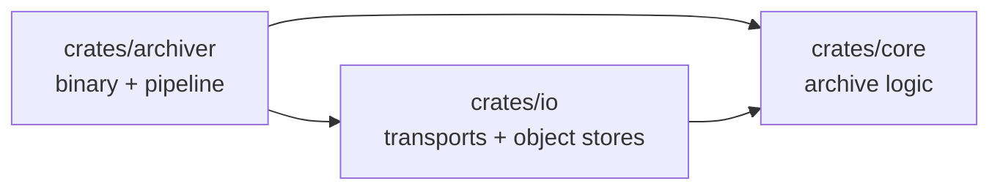

<!--
  Project:      dfe-archiver
  File:         docs/architecture.md
  Purpose:      Crate map, the one-way rules between them, and the build graph
  Language:     Markdown

  License:      BUSL-1.1
  Copyright:    (c) 2026 HyperI Pty Ltd
-->

# dfe-archiver architecture

Where things live and which way the dependencies point. The design itself --
the pipeline, the rolling model, the storage backends -- is
[DESIGN.md](DESIGN.md).

## Codemap

**`crates/core`** (`dfe-archiver-core`) -- the archive logic, with no I/O of its
own. Config types and their validation (`config.rs`), the rolling archive writer
(`archive/`), the tiered hot-and-spool buffer (`buffer/`), destination routing
(`routing/`), the compression codecs (`compression/`), and the storage trait
plus the sink probe every backend implements (`storage.rs`).

**`crates/io`** (`dfe-archiver-io`) -- everything that talks to something else.
The inbound transports, Kafka (`kafka.rs`) or the Push listener (`grpc.rs`),
chosen by `transport.rs`, and the object-store backends behind `create_backend`
(`storage.rs`): file, S3, GCS, Azure Blob and MinIO.

**`crates/archiver`** (`dfe-archiver`) -- the binary and the pipeline that joins
the other two. `archiver.rs` is the loop (receive, route, buffer, write, and
release once a file completes), `main.rs` the scalo `ServiceApp` wiring, CLI and config reloader,
`metrics.rs` the Prometheus surface, and `contract.rs` the deployment contract
the checked-in `Dockerfile` and the Helm chart are generated from.

## Negative invariants

- `core` depends on no other workspace crate.
- `core` has no metrics dependency: it counts what it did and the caller
  records it, which is why `ArchiveWriter::take_files_opened` exists.
- `core` never releases an offset: the writer settles the offsets held on a
  file as it completes, and the caller drains them with
  `ArchiveWriter::take_settled` and releases them through the transport.
- `io` depends on `core` only, never on `archiver`.
- `archiver` is the only crate with a binary and the only reader of the
  deployment contract, so the Dockerfile and the chart have one source.
- No crate is publishable: all three set `publish = false`, and their version
  is inherited from `[workspace.package]` so the release stamp reaches every
  one of them.

## Build graph

`crates/io` is the cold-build bottleneck, and none of it is our code: it carries
`aws-sdk-s3` (with `aws-lc-sys`, which compiles C), `object_store` with the
aws/gcp/azure features, and `rdkafka-sys`, which builds librdkafka through
cmake. The three workspace crates re-check in seconds against a warm
dependency graph.

Change propagation follows the arrows: a `core` edit rebuilds all three, an `io`
edit rebuilds `io` and `archiver`, and an `archiver` edit rebuilds only itself.
